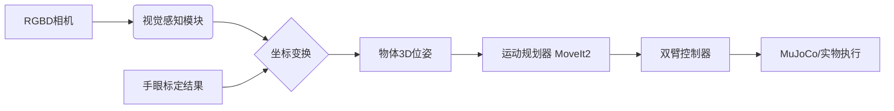

# ROS2 + OpenArm 双臂系统：视觉感知 · 手眼标定 · 运动规划 · 抓取系统

本项目基于 **ROS2 (Humble/Foxy)**、**OpenArm 双臂机器人**、**MuJoCo/Gazebo 仿真环境** 与 **深度相机**，实现从  
**物体检测 → 三维定位 → 手眼标定 → 双臂轨迹规划 → 抓取执行** 的完整智能机器人系统。

---

## 📘 项目简介

本系统实现以下完整闭环流程：

1. 深度相机采集 RGB/Depth 数据
2. 图像/点云预处理
3. 物体检测（传统方法 + 深度模型支持）
4. 目标三维定位（坐标变换 camera → base）
5. 手眼标定（Tsai-Lenz / AX = XB）
6. MoveIt2 运动规划（双臂协同工作）
7. 夹爪控制与抓取状态机
8. 多轮抓取实验统计与误差分析
9. MuJoCo 仿真与实物平台对比验证（若具备实物设备）

---

## 🏗 系统结构图

(可替换为 `docs/system_architecture.png`)
=======


# 🤖 ROS2 + OpenArm 双臂机器人视觉抓取系统


本项目基于 **ROS2 (Humble/Foxy)**、**OpenArm 双臂机器人**、**MuJoCo 仿真环境** 与 **深度相机**，实现从 **物体检测 → 三维定位 → 手眼标定 → 双臂轨迹规划 → 抓取执行** 的完整智能机器人系统。

---

## 📖 目录

- [项目简介](#-项目简介)
- [Git 分支工作流规范](#-git-分支工作流规范)
- [系统架构](#-系统架构)
- [团队分工](#-团队分工)
- [环境依赖](#-环境依赖)
- [安装与构建](#-安装与构建)
- [系统运行说明](#-系统运行说明)
- [项目目录结构](#-项目目录结构)
- [成果展示](#-成果展示)

---

## 📘 项目简介

本系统旨在通过仿真与实物结合的方式，完成双臂机器人的闭环抓取任务。主要流程如下：

1.  **环境感知**：深度相机采集 RGB/Depth 数据，进行图像与点云预处理。
2.  **视觉识别**：使用传统 CV 或深度学习模型进行物体检测与分割。
3.  **三维定位**：将像素坐标转换为相机坐标，并进一步转换至机器人基座坐标系。
4.  **系统标定**：基于 Tsai-Lenz 算法实现 $AX=XB$ 手眼标定。
5.  **运动规划**：利用 MoveIt2 进行双臂避障轨迹规划与协作控制。
6.  **抓取执行**：设计抓取状态机，控制末端夹爪完成 "接近-抓取-提升-放置" 流程。
7.  **仿真验证**：在 MuJoCo 环境中验证物理交互与抓取稳定性。

---

## 🌳 Git 分支工作流规范

为了确保多人协作的代码稳定性，本项目严格采用 **简化版 GitFlow 工作流**。所有成员请务必遵守：

| 分支名称 | 说明 | 权限 |
| :--- | :--- | :--- |
| **`main`** | **主分支（发布版）**。<br>仅存放经过完整测试、稳定且可直接运行的代码。**禁止直接 commit 到此分支。** | 仅限 Merge |
| **`dev`** | **开发主线**。<br>所有最新功能的汇聚地。所有新功能开发必须基于此分支创建。 | 协作开发 |
| **`feature-xxx`** | **功能分支**。<br>个人或小组针对特定任务创建的分支（如 `feature-vision`）。<br>开发完成后，需通过 **Pull Request** 合并回 `dev`。 | 个人开发 |

**开发流程示例：**
```bash
# 1. 切换到 dev 并拉取最新代码
git checkout dev
git pull origin dev

# 2. 创建自己的功能分支
git checkout -b feature-my-task

# ... 编写代码，提交 commit ...

# 3. 推送并请求合并
git push origin feature-my-task
# (然后在 GitHub 网页端发起 Pull Request 合并到 dev)
````

-----

## 🏗 系统架构



<<<<<<< HEAD
相机 → 感知模块 → 物体3D定位 → 手眼标定 → 运动规划器 → 控制器 → 夹爪执行

````

---

## 🔧 功能模块

| 模块 | 功能说明 | 负责人 |
|:---|:---|:---|
| **模型与仿真** | URDF/Xacro 扩展、相机模型、MuJoCo 场景构建 | 成员2 |
| **视觉感知** | 图像/深度处理、物体检测、聚类、三维定位 | 成员3 |
| **手眼标定** | 标定数据采集、AX=XB 求解、误差评估 | 成员4 |
| **运动规划** | MoveIt2 轨迹规划、双臂协作策略 | 成员4 |
| **抓取执行** | 夹爪控制、抓取状态机、成功率统计 | 成员4 |
| **系统集成** | 接口设计、TF 框架、总控 launch、视频录制 | 成员1 |

---

## 📦 环境依赖

### 必要软件

* ROS2 Humble / Foxy
* Python ≥ 3.8
* MoveIt2
* MuJoCo 2.x / mujoco_ros / ros_gz
* PCL / OpenCV

### 安装命令示例

```bash
sudo apt install ros-${ROS_DISTRO}-vision-msgs ros-${ROS_DISTRO}-pcl-ros
pip install opencv-python numpy transforms3d
````
=======
*(详细架构图可见 `docs/system_architecture.png`)*

-----

## 👥 团队分工

| 成员 | 角色 | 负责模块 | 详细职责 |
| :--- | :--- | :--- | :--- |
| **成员1** | **系统集成** | 架构/接口/TF | 接口设计、TF 树管理、总控 Launch 编写、论文统稿 |
| **成员2** | **模型仿真** | URDF/MuJoCo | 机器人/相机 URDF 模型扩展、MuJoCo 场景搭建、物理属性配置 |
| **成员3** | **视觉感知** | Perception | 图像预处理、物体检测算法、点云处理、三维坐标解算 |
| **成员4** | **规划控制** | Calibration/Control | 手眼标定算法实现、MoveIt2 轨迹规划、抓取状态机设计 |

-----

## 📦 环境依赖

### 必要软件

  * **OS**: Ubuntu 22.04 (Humble) / 20.04 (Foxy)
  * **ROS2**: Humble / Foxy
  * **Simulator**: MuJoCo 2.x / `mujoco_ros` / `ros_gz`
  * **Libraries**: MoveIt2, PCL, OpenCV

### 安装命令示例

```bash
# 安装 ROS2 依赖
sudo apt install ros-${ROS_DISTRO}-vision-msgs ros-${ROS_DISTRO}-pcl-ros ros-${ROS_DISTRO}-moveit

# 安装 Python 算法库
pip install opencv-python numpy transforms3d scipy
```
>>>>>>> c7cded9dda7f34e285dccdfd462481ca20aa0585

-----

## ⚙ 安装与构建

```bash
<<<<<<< HEAD
mkdir -p ~/ros2_openarm_ws/src
cd ~/ros2_openarm_ws/src
git clone <本仓库地址>
cd ..
rosdep install --from-paths src -r -y --ignore-src
colcon build
=======
# 1. 创建工作空间
mkdir -p ~/ros2_openarm_ws/src
cd ~/ros2_openarm_ws/src

# 2. 克隆本仓库 (确保在 dev 或 main 分支)
git clone <本仓库GitHub地址>

# 3. 安装依赖
cd ..
rosdep install --from-paths src -r -y --ignore-src

# 4. 编译
colcon build --symlink-install

# 5. 配置环境变量
>>>>>>> c7cded9dda7f34e285dccdfd462481ca20aa0585
source install/setup.bash
```

-----

## 🚀 系统运行说明

<<<<<<< HEAD
### ▶ 启动完整仿真系统
=======
### 1\. 启动完整仿真系统 (System Bringup)

这将启动 MuJoCo 环境、机器人模型、Rviz 可视化以及所有基础节点。
>>>>>>> c7cded9dda7f34e285dccdfd462481ca20aa0585

```bash
ros2 launch system_bringup mujoco_full_system.launch.py
```

<<<<<<< HEAD
启动内容包含：

  * OpenArm 双臂机器人
  * RGBD 相机
  * 桌子与物体模型
  * 感知节点
  * 手眼标定模块
  * 运动规划和控制器

### ▶ 单独运行视觉感知节点

```bash
ros2 launch perception perception.launch.py
```

查看检测结果：

```bash
ros2 topic echo /detected_objects
```

### ▶ 手眼标定流程

采集样本：

```bash
ros2 run calibration collect_samples
```

计算标定矩阵：

```bash
ros2 run calibration compute_hand_eye
```

结果输出：

  * `results/calibration_result.yaml`
  * `results/calibration_error.csv`

### ▶ 抓取规划与执行

```bash
ros2 launch motion_control grasp.launch.py
```

抓取状态机流程：

```
APPROACH → PREGRASP → CLOSE_GRIPPER → LIFT → RETRACT
```

=======
### 2\. 运行视觉感知任务

启动相机驱动与识别节点，发布物体坐标。

```bash
ros2 launch perception perception.launch.py
# 查看检测结果
ros2 topic echo /detected_objects
```

### 3\. 执行手眼标定

采集数据并计算 $AX=XB$ 变换矩阵。

```bash
# 步骤1: 采集标定样本
ros2 run calibration collect_samples
# 步骤2: 计算矩阵
ros2 run calibration compute_hand_eye
```

*结果将保存在 `results/calibration_result.yaml`*

### 4\. 执行抓取任务

启动状态机，执行 "识别-规划-抓取" 闭环。

```bash
ros2 launch motion_control grasp.launch.py
```

>>>>>>> c7cded9dda7f34e285dccdfd462481ca20aa0585
-----

## 📁 项目目录结构

```text
<<<<<<< HEAD
.
├── launch/
│   ├── mujoco_full_system.launch.py
│   ├── perception.launch.py
│   ├── calibration.launch.py
│   └── motion_control.launch.py
│
├── urdf/
│   ├── openarm_with_camera.xacro
│   ├── apple.xacro
│   ├── banana.xacro
│   └── table.xacro
│
├── mujoco/
│   └── mujoco_world.xml
│
├── perception/
│   ├── src/object_detector.py
│   ├── src/pointcloud_processing.py
│   └── config/perception_params.yaml
│
├── calibration/
│   ├── scripts/collect_samples.py
│   └── scripts/compute_hand_eye.py
│
├── motion_control/
│   ├── src/motion_planner.py
│   ├── src/gripper_controller.py
│   └── src/grasp_state_machine.py
│
├── docs/
│   ├── system_architecture.pdf
│   ├── interfaces.md
│   └── hardware_setup.pdf
│
├── results/
│   ├── perception_accuracy.csv
│   ├── grasp_success.csv
│   └── calibration_error.csv
│
└── README.md
=======
ros2-openarm-project/
├── launch/                   # 全局启动文件
├── urdf/                     # 机器人与环境描述文件 (.xacro)
├── mujoco/                   # MuJoCo 仿真配置 (.xml)
├── perception/               # 视觉感知功能包
│   ├── src/                  # 视觉算法源码
│   └── config/               # 识别参数
├── calibration/              # 手眼标定功能包
│   ├── scripts/              # 标定与求解脚本
│   └── results/              # 标定结果文件
├── motion_control/           # 运动控制功能包
│   ├── src/                  # 规划与状态机源码
│   └── config/               # MoveIt配置
├── docs/                     # 项目文档与图纸
├── results/                  # 实验数据记录
└── README.md                 # 项目说明书
>>>>>>> c7cded9dda7f34e285dccdfd462481ca20aa0585
```

-----

## 🎬 成果展示
<<<<<<< HEAD

示例占位符：

  * 🍎 物体检测效果图
  * 🤖 抓取演示截图
  * 📈 标定误差曲线
  * 📊 抓取成功率统计

(建议将资源放在 `media/` 目录)

-----

## 👥 团队成员与详细分工

### **成员1 — 系统架构与集成**

  * 系统架构设计、ROS2 接口定义、TF 框架
  * 总控 launch、仿真整合、论文统稿

### **成员2 — 机械模型与仿真**

  * URDF/Xacro 扩展、相机模型、桌面/物体模型
  * MuJoCo 场景配置、相机参数/噪声建模

### **成员3 — 视觉感知与定位**

  * 图像/深度处理、物体检测、三维定位
  * 定位精度评估实验与可视化

### **成员4 — 手眼标定与规划抓取**

  * AX=XB 标定、误差分析
  * MoveIt2 规划、夹爪控制、抓取状态机
  * 抓取成功率实验

-----

## 📚 参考文献

1.  ROS2 Documentation
2.  MoveIt2 Documentation
3.  MuJoCo Documentation
4.  Tsai R. & Lenz R., “A New Technique for Hand-Eye Calibration”
5.  PCL / OpenCV 官方文档

-----

## 📝 License

MIT License. 可在科研、教学与学习场景中自由使用与修改。

=======

*在此处添加演示材料，建议使用 GIF 或视频链接*

  * **物体检测效果**：
  * **仿真抓取演示**：
  * **标定误差分析**：[点击查看详细报告](https://www.google.com/search?q=results/calibration_error.csv)

-----

## 📚 参考文献

1.  ROS2 Documentation: https://docs.ros.org/
2.  MoveIt2 Tutorials: https://moveit.picknik.ai/
3.  Tsai, R. Y., & Lenz, R. K. (1989). A new technique for fully autonomous and efficient 3D robotics hand/eye calibration.

-----

## 📝 License

本项目遵循 MIT License。仅用于课程设计与学术交流。

```
```
>>>>>>> c7cded9dda7f34e285dccdfd462481ca20aa0585
